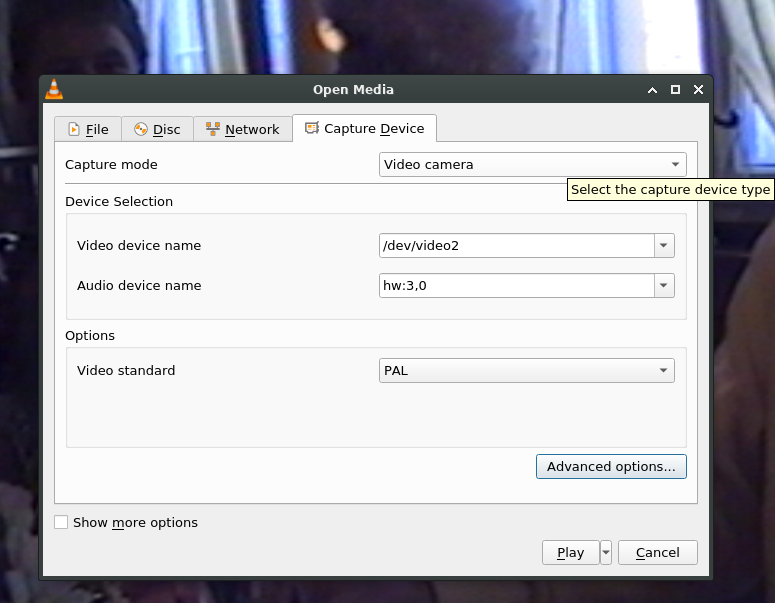

# How to capture VHS video using Pinnacle Dazzle DVC100 on Linux

## Installation
```bash
sudo apt install alsa-utils v4l-utils ffmpeg vlc avidemux
```

## Device Identification
The Pinnacle Dazzle DVC100 on Linux is supported by the em28xx kernel module. Use the following commands to check the device's visibility and identify proper audio device:

```console
foo@bar:~$ lsusb | fgrep DVC100
Bus 001 Device 025: ID 2304:021a Pinnacle Systems, Inc. Dazzle DVC100 Audio Device

foo@bar:~$ udevadm info  /dev/video* | egrep 'DEVNAME|ID_V4L_PRODUCT' | fgrep -B 1 'Dazzle'
E: DEVNAME=/dev/video2
E: ID_V4L_PRODUCT=Pinnacle Dazzle DVC 90/100/101/

foo@bar:~$ cat /proc/asound/cards | fgrep DVC100
3 [DVC100         ]: USB-Audio - DVC100
                      Pinnacle Systems GmbH DVC100 at usb-0000:00:1d.7-6, high speed
```

For the last command, the first column contains the number of the ALSA card. It should be combined with hw: prefix to form the name of ALSA device. For the example above, the name of the device is hw:3,0

## Video and Audio Configuration
Export the names of the video and audio devices as environment variables and configure video and audio settings using `v4l2-ctl`:

```bash
export VIDEO=/dev/video2
export AUDIO=hw:3,0
v4l2-ctl --device $VIDEO \
    --set-standard 5 --set-fmt-video=width=720,height=576 \
    --set-ctrl mute=0 --set-ctrl volume=31
```

Check if V4L settings are applied:
```bash
v4l2-ctl --device $VIDEO --get-standard --get-fmt-video --get-ctrl mute --get-ctrl volume
```

Use ALSA mixer to increase volume of the audio. Min volume is 0, max volume is 1. Default volume is 8 which corresponds to the 50% volume. The following command increases it to 13 which corresponds to the 81% volume:

```bash
amixer -D $AUDIO sset Line 13
```

## Video Capture
Check video capture using `ffplay` and proceed with final video capturing:

```bash
ffmpeg -ar 44100 -thread_queue_size 1024 -f alsa -i $AUDIO \
    -itsoffset -0.5 -r 25 -thread_queue_size 1024 -i $VIDEO \
    -filter_complex 'channelmap=FL-0' -filter_complex 'crop=w=700:h=556:x=8:y=0' \
    -map 1:v  -map 0:a -codec:v ffv1 -codec:a pcm_s16le \
    -f matroska  - | ffplay -
```

At this stage the picture and sound should be correct. Audio and video can still be not synchronized but it is difficult to fix on this stage, so we will fix it after capturing.

Final command for capturing:

```bash
sudo ionice -c 1 -n 0 nice -n -20 ffmpeg \
	-ar 44100 -thread_queue_size 1024 -f alsa -i $AUDIO \
	-r 25 -thread_queue_size 1024 -i $VIDEO \
	-filter_complex 'channelmap=FL-0' -filter_complex 'crop=w=700:h=556:x=8:y=0' \
	-map 1:v  -map 0:a -codec:v ffv1 -codec:a pcm_s16le \
	raw.mkv
```

## Post Processing
Apply filters and compression parameters before final compression:

```bash
ffmpeg -i shifted.mkv -filter:v yadif \
    -codec:a libmp3lame -q:a 5 \
    -codec:v libx264 -crf 26 -preset slow \
    -tune film -pix_fmt yuv420p compressed.mkv
```

## Capture Using VLC GUI
1. Open VLC
2. Media -> Open Capture Device
3. Set capture mode, video device name, audio device name, and video standard.
4. Go to Advanced options, set width and height.



```
**Note:** The best quality capture is achieved without VLC. Tweaking parameters with `ionice` and `ffmpeg` yields better results.
```
